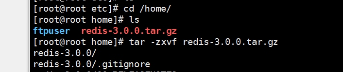

# redis安装流程
* 下载文件 [redis3.0](https://pan.baidu.com/s/1eTOJJvO)  

*  ftp上传  

*  解压  

*  编译  

  

* 安装到指定目录  

  
*  拷贝配置文件到安装目录下  

*  修改配置文件使redis后台启动  

*  后台启动rdis  

*  查看redis进程  

*  停止redis  

*  进入redis客户端  

